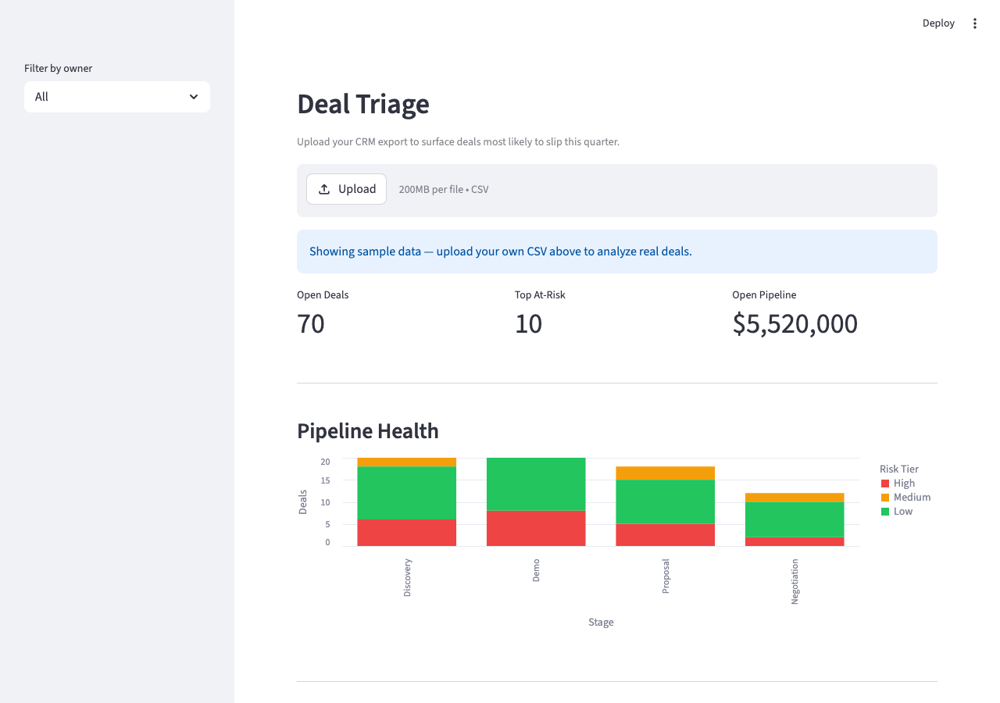

# Deal Triage

**[Read the case study →](https://julianross.dev/case-studies/deal-triage/)**

B2B SaaS pipeline risk scoring — heuristic signals + Claude analysis for AEs and RevOps managers.

[](https://deal-triage-julian-ross.streamlit.app)



## What it does

AEs and managers lose deals when they begin to slip before anyone notices. Spreadsheet pipeline reviews are slow and dashboards only show lagging indicators. Reps miss signals like slowly-expanding timelines, stale activity, and call transcripts with buried red flags.

Deal Triage ingests a CRM export (HubSpot-style CSV), scores every open deal on three heuristic dimensions, and surfaces the top 10 at-risk deals with Claude-powered analysis. With an API key, each deal gets verbatim transcript quotes as evidence, a tiered risk analysis matched to the strength of available signals, and a concrete next action for the AE to take this week.

## Features (v1.5)

- **Heuristic scoring** — 0–100 composite score from stage velocity, activity recency, and close date pressure
- **Stage-velocity benchmarking** — stage medians computed from your actual pipeline history, not hardcoded thresholds
- **Tiered Claude analysis** — High-confidence deals (strong signals + transcript) get a full deal memo with buying process analysis; lower-confidence deals get a focused brief
- **Verbatim transcript quotes** — Claude extracts the specific call moments driving the risk score
- **Model switcher** — toggle between Haiku (fast) and Sonnet (deeper analysis) in the sidebar
- **Follow-up email drafts** — one-click email draft for any deal, grounded in Claude's analysis
- **Feedback loop** — 👍/👎 on each analysis, stored locally with timestamps for prompt tuning
- **Export enriched CSV** — download ranked deals + Claude analysis as a CSV
- **Methodology tab** — in-app explanation of the scoring model and how AEs should use it
- **Onboarding banner** — step-by-step guide for first-time users, collapses after first view

## How it works

### Heuristic scoring (0–100 per deal)

| Dimension | Max pts | Logic |
|-----------|---------|-------|
| Days in stage | 40 | Linear to 2× team median for that stage (computed from full pipeline history) |
| Activity recency | 30 | 0–6 days stale: 0–13 pts · 7–13 days: 14 pts · 14–20 days: 22 pts · 21+ days: 30 pts |
| Close date pressure | 30 | Past due: 30 · <14 days: 25 · 15–30 days: 15 · 31–60 days: 5 · 60+ days: 0 |

Closed Won and Closed Lost deals are filtered out before scoring. Only open pipeline is ranked.

### Claude analysis (optional, tiered by confidence)

For each of the top 10 at-risk deals, Claude reads the CRM fields and any available call transcript. Output is tiered by confidence level:

- **High confidence** (score ≥ 70 + transcript present): full deal memo — executive summary, verbatim transcript quotes, risk signals with evidence, buying process analysis, prioritized recommended actions
- **Medium confidence**: focused brief, 1–2 quotes, risk signal list, one concrete next action
- **Low confidence**: 2–3 sentence brief, one concrete next action

The prompt lives in `prompts/deal_risk_explanation.md` — transparent, editable, and tunable to your team's sales motion.

Results are cached in session state — the API is only called when you click "Analyze with Claude," not on every UI interaction.

## Getting started

**Prerequisites:** Python 3.9+, pip

```bash
git clone https://github.com/jross21/deal-triage.git
cd deal-triage
python3 -m venv .venv && source .venv/bin/activate
pip install -r requirements.txt
streamlit run app.py
```

The app loads with 100 synthetic deals automatically — no API key needed to see the scoring view.

**To enable Claude explanations:**

```bash
cp .env.example .env
# open .env and set ANTHROPIC_API_KEY=your_key_here
streamlit run app.py
```

An "Analyze with Claude" button will appear. Click it to generate explanations for the top 10 at-risk deals (~15 seconds for all 10).

## CSV format

Upload any CSV with these fields:

| Field | Type | Notes |
|-------|------|-------|
| `deal_id` | string | Unique identifier |
| `account_name` | string | Company name |
| `stage` | string | `Discovery`, `Demo`, `Proposal`, `Negotiation`, `Closed Won`, `Closed Lost` |
| `amount` | number | Deal value in dollars |
| `close_date` | YYYY-MM-DD | Expected close |
| `days_in_stage` | integer | Days since last stage change |
| `last_activity_date` | YYYY-MM-DD | Most recent logged activity |
| `next_step` | string | AE's documented next action (can be blank) |
| `owner` | string | AE name |
| `industry` | string | Account industry |
| `employee_count` | integer | Account headcount |

## Project structure

```
deal-triage/
├── app.py                         # Streamlit app — UI, scoring, orchestration
├── claude_client.py               # Claude API logic — tiered analysis + email drafts
├── feedback.py                    # Feedback storage (timestamped JSON, gitignored)
├── METHODOLOGY.md                 # 1500-word AE deal risk methodology (also in-app)
├── prompts/
│   └── deal_risk_explanation.md  # Claude prompt — tiered output with quote extraction
├── data/sample/
│   ├── opportunities.csv         # 100 synthetic deals — ships with the app
│   └── transcripts/              # 15 call transcript snippets, keyed by deal_id
├── data/feedback/                 # Local feedback storage — gitignored, created on first use
├── scripts/
│   └── generate_sample_data.py  # Reproducible data generator (seed=42)
├── .env.example                  # API key template
└── requirements.txt
```

To regenerate the sample data:

```bash
python3 scripts/generate_sample_data.py
```

## Roadmap

**v2 — Live data**
n8n workflow that pulls open opportunities from HubSpot on a daily schedule, runs the same scoring pipeline, and posts a Slack digest of the top at-risk deals to the team channel. No manual CSV export required.

**v3 — Warehouse model**
dbt project modeling deal signal data — stage velocity, rep activity patterns, win/loss rates by segment — so the heuristic weights can be tuned against actual historical outcomes rather than rules of thumb.

## Built with

Python · [Streamlit](https://streamlit.io) · [Anthropic Claude](https://anthropic.com) · pandas · python-dotenv
